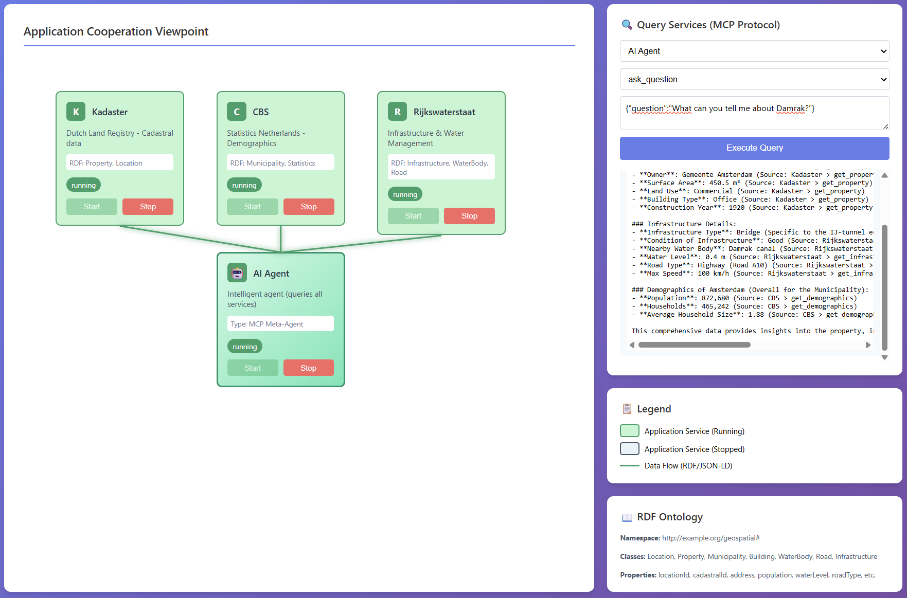

# A Federated Knowledge Graph Architecture for Dutch Cadastral Data - Proof of Concept

This repository contains the proof-of-concept implementation for the research paper *"A Federated Knowledge Graph Architecture for Dutch Cadastral Data"*. The system demonstrates how independently operated Dutch government agencies can expose complementary geospatial and cadastral data through a federated knowledge graph, without centralising data or surrendering data sovereignty.

## Proof of Concept

Three Dutch government organisations are modelled:

- **Kadaster** (Dutch Land Registry) — cadastral and property data via three key registers:
  - BAG (Basisregistratie Adressen en Gebouwen) — buildings and addresses
  - BGT (Basisregistratie Grootschalige Topografie) — large-scale topography
  - BRT (Basisregistratie Topografie) — topographic maps
- **CBS** (Statistics Netherlands) — demographic and statistical data
- **Rijkswaterstaat** (Ministry of Infrastructure) — infrastructure and water management data



## Architecture

```console
┌──────────────────────────────────────────────────────────────────────────────────┐
│                        HTML Dashboard (ArchiMate View)                           │
│  ┌─────────────────────────────────────────┐                                     │
│  │              Kadaster                   │                                     │
│  │  ┌───────┐   ┌───────┐   ┌───────┐      │   ┌───────┐   ┌──────────────────┐  │
│  │  │  BAG  │   │  BGT  │   │  BRT  │      │   │  CBS  │   │ Rijkswaterstaat  │  │
│  │  │(Addr.)│   │(Topo) │   │(Topo) │      │   │(Stats)│   │ (Infrastructure) │  │
│  │  └───────┘   └───────┘   └───────┘      │   └───────┘   └──────────────────┘  │
│  └─────────────────────────────────────────┘        │               │            │
│        │             │            │                 │               │            │
│        └─────────────┴────────────┴─────────────────┴───────────────┘            │
│                                    │                                             │
│                              RDF Data Flows                                      │
└────────────────────────────────────┬─────────────────────────────────────────────┘
                                     │
                                     ↓
                            ┌────────────────┐
                            │   MCP Client   │
                            │  (Orchestrator)│
                            └────────────────┘
                                     │
        ┌──────────────┬─────────────┼─────────────┬──────────────┐
        ↓              ↓             ↓             ↓              ↓
┌─────────────┐ ┌─────────────┐ ┌─────────────┐ ┌─────────────┐ ┌──────────────────┐
│ MCP Server  │ │ MCP Server  │ │ MCP Server  │ │ MCP Server  │ │ MCP Server       │
│    (BAG)    │ │    (BGT)    │ │    (BRT)    │ │    (CBS)    │ │(Rijkswaterstaat) │
│ + RDF Store │ │ + RDF Store │ │ + RDF Store │ │ + RDF Store │ │  + RDF Store     │
└─────────────┘ └─────────────┘ └─────────────┘ └─────────────┘ └──────────────────┘
    Docker          Docker          Docker          Docker           Docker
  Container       Container       Container       Container        Container
```

**Key technologies:**

- **RDF/JSON-LD** — semantic interoperability via a shared geospatial ontology
- **MCP (Model Context Protocol)** — service discovery, tool invocation, and federation
- **Docker** — isolated, reproducible per-agency service deployment
- **JSON-RPC 2.0** — transport layer between orchestrator and services

## Shared Geospatial Ontology

All five services share a common RDF ontology (`ontology/geospatial.ttl`), which is the semantic backbone of the federation.

**Classes:** Location, Property, Municipality, Province, Building, WaterBody, Road, Infrastructure

**Properties:**

- Identification: `locationId`, `cadastralId`, `bagId`
- Geographic: `address`, `postalCode`, `coordinates` (RD), `latitude`, `longitude`
- Kadaster: `owner`, `surfaceArea`, `landUse`, `buildingType`, `constructionYear`
- CBS: `population`, `households`, `averageIncome`, `populationDensity`, `unemploymentRate`
- Rijkswaterstaat: `waterType`, `waterLevel`, `roadType`, `roadNumber`, `infrastructureType`

**Namespace:** `http://imx-geo-prime.org/geospatial#`

## Proof-of-Concept Data

The PoC uses synthetic but representative data for three locations. Each location appears in all five services, validating that the federation correctly resolves cross-agency joins by `locationId`.

| ID     | Location                 | Kadaster                                | CBS                        | Rijkswaterstaat                  |
|--------|--------------------------|-----------------------------------------|----------------------------|----------------------------------|
| LOC001 | Amsterdam, Damrak 1      | AMS01-G-1234, 450.5 m², office (1920)   | 872,680 pop., avg. €38,500 | IJ-tunnel, Damrak canal, A10     |
| LOC002 | Utrecht, Oudegracht 231  | UTR02-K-5678, 320 m², university (1636) | 361,966 pop., avg. €35,200 | Weerdsluis lock, Oudegracht, A12 |
| LOC003 | Rotterdam, Coolsingel 40 | RTD03-A-9012, 1200 m², municipal (1914) | 651,446 pop., avg. €31,900 | Erasmusbrug, Nieuwe Maas, A15    |

## AI Agent

The system includes an AI agent powered by Azure OpenAI that answers natural language queries by autonomously selecting and querying the relevant MCP services, illustrating how LLM-based reasoning can drive federated knowledge graph queries without a fixed query plan.

**Example queries:**

- "What is the population of Amsterdam?"
- "Compare the infrastructure in Utrecht and Rotterdam"
- "Tell me about the property and demographics in Amsterdam"
- "Which city has the highest population density?"

See [AGENTS.md](AGENTS.md) for full documentation.

## Quick Start

### 1. Install dependencies

```console
uv sync
```

### 2. Configure Azure OpenAI

```console
# .env in the project root
AZURE_OPENAI_ENDPOINT=https://your-resource.openai.azure.com/
AZURE_OPENAI_API_KEY=your-api-key-here
AZURE_OPENAI_DEPLOYMENT_NAME=your-deployment-name
AZURE_OPENAI_API_VERSION=2024-12-01-preview
```

### 3. Start the orchestrator

```console
cd client
python orchestrator.py
```

This builds all Docker images, starts the FastAPI server on port 5000 (Swagger UI at `/docs`), and begins logging to `/tmp/orchestrator.log`.

### 4. Open the dashboard

```console
cd dashboard
python -m http.server 8080
```

Navigate to `http://localhost:8080`, then start each service (BAG, BGT, BRT, CBS, Rijkswaterstaat) using the dashboard controls.

## MCP Services

### BAG — Addresses & Buildings

**Tools:** `find_address`, `get_building`, `get_address`, `list_addresses`  
**RDF entities:** Address, Building

### BGT — Large-Scale Topography

**Tools:** `find_area`, `get_terrain`, `get_roads`, `get_water`  
**RDF entities:** TopographicArea, Road, WaterBody

### BRT — Topographic Maps

**Tools:** `find_place`, `get_boundaries`, `get_place_names`, `get_landscape`, `list_municipalities`  
**RDF entities:** GeographicName, AdministrativeBoundary, LandscapeFeature

### CBS — Statistics Netherlands

**Tools:** `list_locations`, `get_statistics`, `get_demographics`  
**RDF entities:** Municipality, Statistics

### Rijkswaterstaat — Infrastructure & Water Management

**Tools:** `list_roads`, `get_infrastructure`, `get_water_level`  
**RDF entities:** Infrastructure, WaterBody, Road

## Federated Query Example

The following cross-agency query illustrates the core contribution: assembling a complete view of a location from five independent authoritative sources, each owning its own RDF store.

```console
# 1. Building data (Kadaster / BAG)
{"service": "bag-service",            "tool": "get_building",       "arguments": {"location_id": "LOC002"}}

# 2. Topographic data (Kadaster / BGT)
{"service": "bgt-service",            "tool": "get_terrain",        "arguments": {"location_id": "LOC002"}}

# 3. Administrative boundaries (Kadaster / BRT)
{"service": "brt-service",            "tool": "get_boundaries",     "arguments": {"location_id": "LOC002"}}

# 4. Demographic statistics (CBS)
{"service": "cbs-service",            "tool": "get_statistics",     "arguments": {"location_id": "LOC002"}}

# 5. Infrastructure (Rijkswaterstaat)
{"service": "rijkswaterstaat-service","tool": "get_infrastructure", "arguments": {"location_id": "LOC002"}}
```

Federated result — Utrecht (Oudegracht 231):

- **Building**: Education, 3200 m², built 1636
- **Topography**: Urban centre, brick surface, Oudegracht canal
- **Administrative**: Utrecht municipality, De Stichtse Rijnlanden water board
- **Demographics**: 361,966 residents, avg. income €35,200
- **Infrastructure**: Weerdsluis lock, Oudegracht canal, A12 highway

## REST API

- `GET  /api/services` — list all services and statuses
- `POST /api/services/:name/start` — start a service container
- `POST /api/services/:name/stop` — stop a service container
- `POST /api/query` — execute MCP queries across services
- `POST /api/agent/ask` — submit a natural language query to the AI agent
- `GET  /api/ontology` — retrieve the geospatial ontology in Turtle format

```console
curl -X POST http://localhost:5000/api/agent/ask \
  -H "Content-Type: application/json" \
  -d '{"question": "What is the population of Utrecht?"}'
```

## Project Structure

```console
.
├── ontology/
│   └── geospatial.ttl                # Shared RDF geospatial ontology
├── mcp-servers/
│   ├── Dockerfile.shared             # Shared distroless Docker image
│   ├── bag-service/server.py
│   ├── bgt-service/server.py
│   ├── brt-service/server.py
│   ├── cbs-service/server.py
│   └── rijkswaterstaat-service/server.py
├── client/
│   └── orchestrator.py               # Federated query orchestrator (MCP client)
├── dashboard/
│   └── index.html
└── docker-compose.yml
```

## Technical Notes

### Semantic interoperability

The shared ontology ensures that every cross-agency response uses a consistent vocabulary and that `locationId` serves as the federated join key across all five RDF stores.

### MCP transport

JSON-RPC 2.0 over stdio; Docker socket communication with multiplexing header handling; automatic error recovery and UTF-8 encoding. See [TROUBLESHOOTING.md](TROUBLESHOOTING.md) for details.

### Docker deployment

Services use a distroless base image (`gcr.io/distroless/python3-debian12`) via a shared multi-stage Dockerfile (`/mcp-servers/Dockerfile.shared`). This eliminates a shell, reduces the attack surface, and keeps image size at ~91 MB versus ~177 MB for `python:3.14-slim`. Each container runs without exposed ports and has an independent lifecycle managed by the orchestrator.

### MCP Inspector

```console
./scripts/inspect-mcp.sh bag-service
./scripts/inspect-mcp.sh bgt-service
./scripts/inspect-mcp.sh brt-service
./scripts/inspect-mcp.sh cbs-service
./scripts/inspect-mcp.sh rijkswaterstaat-service

# Inspect a running container
./scripts/inspect-mcp.sh bag-service --docker

# Inspect the agent service (requires Azure credentials in .env)
./scripts/inspect-mcp.sh agent-service
```

Opens a web UI at `http://localhost:5173`.

## Relation to Dutch Cadastral Standards

The architecture reflects the Dutch *stelsel van basisregistraties* (system of key registers):

- **BAG** — Basisregistratie Adressen en Gebouwen (buildings and addresses)
- **BGT** — Basisregistratie Grootschalige Topografie (large-scale topography)
- **BRT** — Basisregistratie Topografie (topographic maps)
- **BRK** — Basisregistratie Kadaster (cadastral registry)
- **RD coordinates** — Rijksdriehoekscoördinaten coordinate system

Many Dutch government datasets are already published as Linked Data / RDF, making a federated knowledge graph architecture a natural fit for this domain.

## References

- [Kadaster](https://www.kadaster.nl/)
- [CBS](https://www.cbs.nl/)
- [Rijkswaterstaat](https://www.rijkswaterstaat.nl/)
- [Model Context Protocol](https://modelcontextprotocol.io/)
- [ArchiMate](https://www.opengroup.org/archimate-forum)
- [RDF/JSON-LD](https://json-ld.org/)
